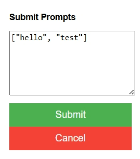

# ChatGPT Bulk Prompts Chrome Extension

**ChatGPT Bulk Prompts Chrome Extension** is a Chrome extension designed to simplify the submission of prompts in bulk to a ChatGPT-like interface. This tool allows you to enter a list of prompts in JSON format, and it will submit them sequentially to the active tab's input field.

This plugin was developed mainly by ChatGPT itself and I just made minor modifications to the code. The coding style does not reflect my usual style, nor is it necessarily optimized nor simplified. It simply works for my own needs.



## Features

- **Bulk Submission**: Submit multiple prompts at once in a sequence.
- **Pause and Resume**: You can cancel the prompt submission process midway.
- **JSON Input**: The extension accepts prompts in a simple JSON array format.
- **Concatenated Submissions**: Add more prompts to existing queue

## Installation

To install and use this extension:

1. **Clone or download the repository**:

2. **Load the extension in Chrome**:
   - Open Chrome and go to `chrome://extensions/`.
   - Enable "Developer mode" by toggling the switch in the upper-right corner.
   - Click "Load unpacked" and select the directory where you downloaded or cloned the repository.

3. **Use the extension**:
   - Once loaded, you'll see the ChatGPT Bulk Prompts Chrome Extension icon in your extensions list. Click on it to open the extension.

## How to Use

1. **Enter Prompts**:
   - In the extension popup, enter your prompts as a JSON array in the `textarea`. For example:
     ```json
     [
       "What is AI?",
       "Tell me about machine learning.",
       "Explain deep learning."
     ]
     ```

2. **Submit Prompts**:
   - Click the **Submit** button to start the submission process. The extension will automatically input and submit each prompt sequentially into the active tab where the ChatGPT interface is open.

3. **Cancel Submission**:
   - You can cancel the submission process anytime by clicking the **Cancel** button. The remaining prompts will be cleared, and the status will reflect that the process has been canceled.

## Known Issues

- **Prompt Submission Cancellation**: If prompts are canceled midway, the process may be stuck waiting for the submit button to be active, you can clear it by writing anything in the prompt input field on the chatGPT interface.

## License

This project is licensed under the MIT License.
